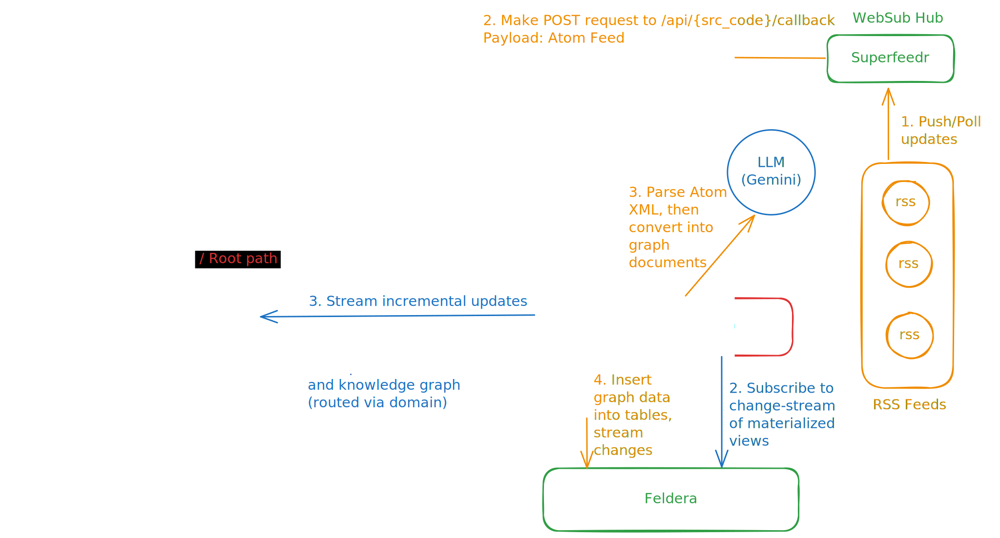
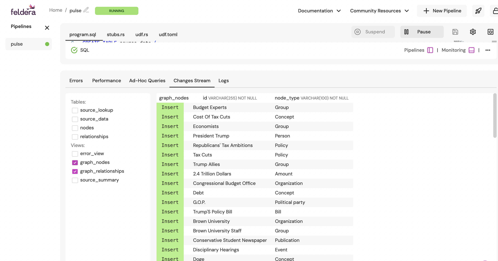
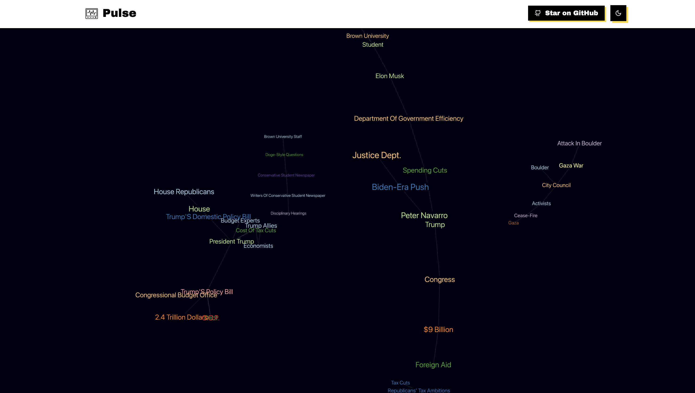
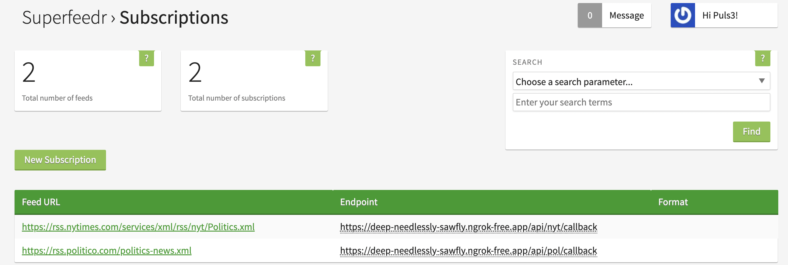

# Pulse
Pulse is a news analysis platform that prioritizes computational efficiency to deliver lightning-fast updates

## Features
- Built for adaptability, `Pulse` can be easily extended to support a wide range of use cases with minimal effort.
- What truly sets `Pulse` apart, however, is its exceptional efficiency. Powered by [Feldera’s](https://www.feldera.com/) incremental query engine, it streams only meaningful updates—avoiding redundant data and drastically reducing latency, even at massive scale
- Leveraging the [WebSub](https://en.wikipedia.org/wiki/WebSub) protocol, Pulse receives updates the moment they're published, eliminating the need for constant polling and ensuring fast, bandwidth-efficient delivery of fresh content
- Pulse uses [LangChain](https://www.langchain.com/) and LLMs to extract insights and generate nodes and links from news which when combined with Feldera results in a dynamic knowledge graph that updates in real-time

## Overview

### [pulse-server](pulse-server)
Backend server serving rest-apis and interacting with the query engine

### [pulse-ui](pulse-ui)
Frontend of the applications
[![Next][https://img.shields.io/badge/next.js-000000?style=for-the-badge&logo=nextdotjs&logoColor=white]][https://nextjs.org/]
### [pulse-proxy](pulse-proxy)
Provides public domain, proxy with secure tunnel and path-based routing

## Output
### Feldera Change Stream
Incremental updates to materialized views graph_nodes and graph_relationships pushed to frontend

### Traefik Proxy
Path based routing to `pulse-server` and `pulse-ui`

### Knowledge Graph
Dynamic Knowledge graph constructed in real-time with updates from `feldera`

### Websub Hub
Websub hub for subscribing to RSS feeds which pushes real-time news updates

