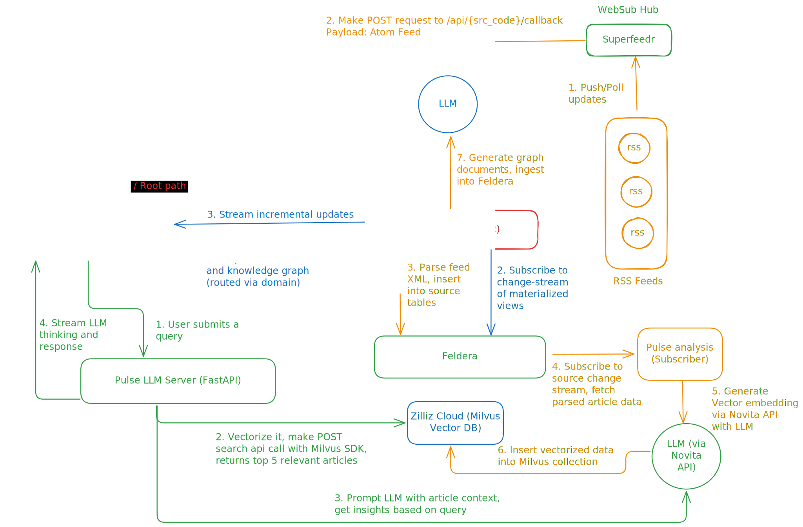
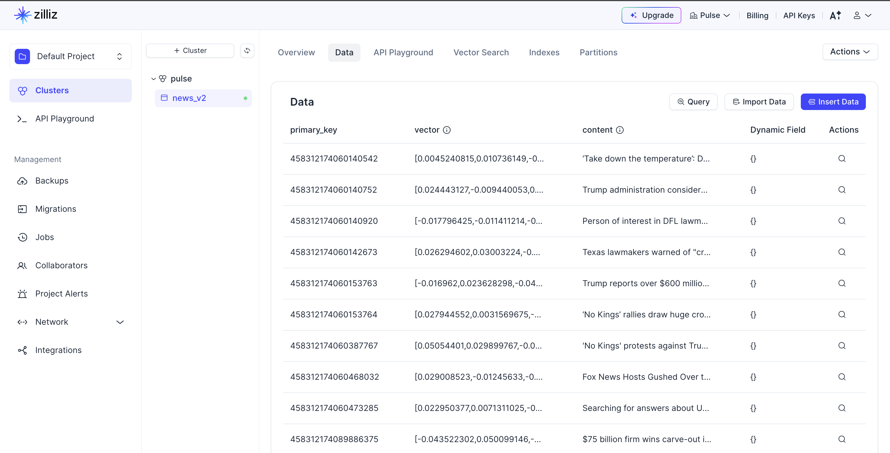
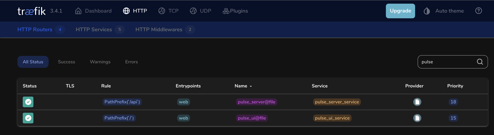

# Pulse
Pulse is a news analysis platform that prioritizes computational efficiency to deliver lightning-fast updates

## Features
- Built for adaptability, `Pulse` can be easily extended to support a wide range of use cases with minimal effort.
- What truly sets `Pulse` apart, however, is its exceptional efficiency. Powered by [Feldera’s](https://www.feldera.com/) incremental query engine, it streams only meaningful updates—avoiding redundant data and drastically reducing latency, even at massive scale
- Leveraging the [WebSub](https://en.wikipedia.org/wiki/WebSub) protocol, Pulse receives updates the moment they're published, eliminating the need for constant polling and ensuring fast, bandwidth-efficient delivery of fresh content
- Pulse uses [LangChain](https://www.langchain.com/) and LLMs to extract insights and generate nodes and links from news which when combined with Feldera results in a dynamic knowledge graph that updates in real-time

## Overview

## Components
### [pulse-server](pulse-server)
Backend server serving rest-apis and interacting with the query engine

 [![tokio](https://img.shields.io/badge/tokio-fff?style=for-the-badge&logo=data:image/svg%2bxml;base64,PD94bWwgdmVyc2lvbj0iMS4wIiBlbmNvZGluZz0iVVRGLTgiIHN0YW5kYWxvbmU9Im5vIj8+Cjxzdmcgd2lkdGg9IjEyMHB4IiBoZWlnaHQ9IjEwOHB4IiB2aWV3Qm94PSIwIDAgMTIwIDEwOCIgdmVyc2lvbj0iMS4xIiB4bWxucz0iaHR0cDovL3d3dy53My5vcmcvMjAwMC9zdmciIHhtbG5zOnhsaW5rPSJodHRwOi8vd3d3LnczLm9yZy8xOTk5L3hsaW5rIj4KICAgIDwhLS0gR2VuZXJhdG9yOiBTa2V0Y2ggNDAuMSAoMzM4MDQpIC0gaHR0cDovL3d3dy5ib2hlbWlhbmNvZGluZy5jb20vc2tldGNoIC0tPgogICAgPHRpdGxlPk1hcmsgQ29weTwvdGl0bGU+CiAgICA8ZGVzYz5DcmVhdGVkIHdpdGggU2tldGNoLjwvZGVzYz4KICAgIDxkZWZzPjwvZGVmcz4KICAgIDxnIGlkPSJQYWdlLTEiIHN0cm9rZT0ibm9uZSIgc3Ryb2tlLXdpZHRoPSIxIiBmaWxsPSJub25lIiBmaWxsLXJ1bGU9ImV2ZW5vZGQiPgogICAgICAgIDxnIGlkPSIwMSIgdHJhbnNmb3JtPSJ0cmFuc2xhdGUoLTkwMC4wMDAwMDAsIC0yNzUuMDAwMDAwKSIgZmlsbD0iIzAwMDAwMCI+CiAgICAgICAgICAgIDxnIGlkPSJHcm91cC1Db3B5LTIiIHRyYW5zZm9ybT0idHJhbnNsYXRlKDkwMC4wMDAwMDAsIDI3NS4wMDAwMDApIj4KICAgICAgICAgICAgICAgIDxnIGlkPSJHcm91cCI+CiAgICAgICAgICAgICAgICAgICAgPGcgaWQ9Ik1hcmstQ29weSI+CiAgICAgICAgICAgICAgICAgICAgICAgIDxwb2x5Z29uIGlkPSJMaW5lLUNvcHktMyIgdHJhbnNmb3JtPSJ0cmFuc2xhdGUoMzcuMDAwMDAwLCA2Ny4wMDAwMDApIHJvdGF0ZSgtMzAwLjAwMDAwMCkgdHJhbnNsYXRlKC0zNy4wMDAwMDAsIC02Ny4wMDAwMDApICIgcG9pbnRzPSIzNSA3NC4wNTE2MDc4IDM1IDc2IDM5IDc2IDM5IDc0LjA1MTYwNzggMzkgNTkuOTQ4MzkyMiAzOSA1OCAzNSA1OCAzNSA1OS45NDgzOTIyIj48L3BvbHlnb24+CiAgICAgICAgICAgICAgICAgICAgICAgIDxwb2x5Z29uIGlkPSJMaW5lIiB0cmFuc2Zvcm09InRyYW5zbGF0ZSg4My4wMDAwMDAsIDY3LjAwMDAwMCkgcm90YXRlKC02MC4wMDAwMDApIHRyYW5zbGF0ZSgtODMuMDAwMDAwLCAtNjcuMDAwMDAwKSAiIHBvaW50cz0iODEgNzQuMDUxNjA3OCA4MSA3NiA4NSA3NiA4NSA3NC4wNTE2MDc4IDg1IDU5Ljk0ODM5MjIgODUgNTggODEgNTggODEgNTkuOTQ4MzkyMiI+PC9wb2x5Z29uPgogICAgICAgICAgICAgICAgICAgICAgICA8cGF0aCBkPSJNODAsNTQgQzgwLDQyLjk1NDMwNSA3MS4wNDU2OTUsMzQgNjAsMzQgQzQ4Ljk1NDMwNSwzNCA0MCw0Mi45NTQzMDUgNDAsNTQgQzQwLDY1LjA0NTY5NSA0OC45NTQzMDUsNzQgNjAsNzQgQzcxLjA0NTY5NSw3NCA4MCw2NS4wNDU2OTUgODAsNTQgWiBNNDQuMjMyODA0Miw1NCBDNDQuMjMyODA0Miw0NS4yOTIwMTgyIDUxLjI5MjAxODIsMzguMjMyODA0MiA2MCwzOC4yMzI4MDQyIEM2OC43MDc5ODE4LDM4LjIzMjgwNDIgNzUuNzY3MTk1OCw0NS4yOTIwMTgyIDc1Ljc2NzE5NTgsNTQgQzc1Ljc2NzE5NTgsNjIuNzA3OTgxOCA2OC43MDc5ODE4LDY5Ljc2NzE5NTggNjAsNjkuNzY3MTk1OCBDNTEuMjkyMDE4Miw2OS43NjcxOTU4IDQ0LjIzMjgwNDIsNjIuNzA3OTgxOCA0NC4yMzI4MDQyLDU0IFoiIGlkPSJPdmFsLUNvcHktMiI+PC9wYXRoPgogICAgICAgICAgICAgICAgICAgICAgICA8Y2lyY2xlIGlkPSJPdmFsLUNvcHktNiIgY3g9IjI0IiBjeT0iNzUiIHI9IjMiPjwvY2lyY2xlPgogICAgICAgICAgICAgICAgICAgICAgICA8Y2lyY2xlIGlkPSJPdmFsLUNvcHktMTIiIGN4PSI2MCIgY3k9Ijk2IiByPSIzIj48L2NpcmNsZT4KICAgICAgICAgICAgICAgICAgICAgICAgPGNpcmNsZSBpZD0iT3ZhbC1Db3B5LTEzIiBjeD0iNjAiIGN5PSIxMiIgcj0iMyI+PC9jaXJjbGU+CiAgICAgICAgICAgICAgICAgICAgICAgIDxjaXJjbGUgaWQ9Ik92YWwtQ29weS0xNCIgY3g9Ijk2IiBjeT0iMzMiIHI9IjMiPjwvY2lyY2xlPgogICAgICAgICAgICAgICAgICAgICAgICA8Y2lyY2xlIGlkPSJPdmFsLUNvcHktMTYiIGN4PSIyNCIgY3k9IjMzIiByPSIzIj48L2NpcmNsZT4KICAgICAgICAgICAgICAgICAgICAgICAgPGNpcmNsZSBpZD0iT3ZhbC1Db3B5LTE1IiBjeD0iOTYiIGN5PSI3NSIgcj0iMyI+PC9jaXJjbGU+CiAgICAgICAgICAgICAgICAgICAgICAgIDxlbGxpcHNlIGlkPSJPdmFsLUNvcHktNiIgY3g9IjYwIiBjeT0iNTQiIHJ4PSIzIiByeT0iMyI+PC9lbGxpcHNlPgogICAgICAgICAgICAgICAgICAgICAgICA8cG9seWdvbiBpZD0iTGluZSIgcG9pbnRzPSIyIDUyIC00LjQyMzEyODUzZS0xMyA1MiAtNC41NDc0NzM1MWUtMTMgNTYgMiA1NiA0MCA1NiA0MiA1NiA0MiA1MiA0MCA1MiI+PC9wb2x5Z29uPgogICAgICAgICAgICAgICAgICAgICAgICA8cG9seWdvbiBpZD0iTGluZSIgcG9pbnRzPSI4MCA1MiA3OCA1MiA3OCA1NiA4MCA1NiAxMTggNTYgMTIwIDU2IDEyMCA1MiAxMTggNTIiPjwvcG9seWdvbj4KICAgICAgICAgICAgICAgICAgICAgICAgPHBvbHlnb24gaWQ9IkxpbmUtQ29weS00IiBwb2ludHM9IjcyLjgyOTkxNjcgNzAuMzg4NTcyNSA3MS44MjMxNzA4IDY4LjY2MDQzNCA2OC4zNjY4OTM3IDcwLjY3MzkyNTggNjkuMzczNjM5NiA3Mi40MDIwNjQzIDg4LjUwMTgxMTYgMTA1LjIzNjY5NiA4OS41MDg1NTc1IDEwNi45NjQ4MzQgOTIuOTY0ODM0NSAxMDQuOTUxMzQzIDkxLjk1ODA4ODYgMTAzLjIyMzIwNCI+PC9wb2x5Z29uPgogICAgICAgICAgICAgICAgICAgICAgICA8cG9seWdvbiBpZD0iTGluZS1Db3B5LTQiIHBvaW50cz0iMzIuNTgxMzY4NCAyLjE0MDAyNDIzIDMxLjU3NDYyMjUgMC40MTE4ODU3MjIgMjguMTE4MzQ1NSAyLjQyNTM3NzUxIDI5LjEyNTA5MTQgNC4xNTM1MTYwMiA0OC4yNTMyNjMzIDM2Ljk4ODE0NzcgNDkuMjYwMDA5MiAzOC43MTYyODYyIDUyLjcxNjI4NjIgMzYuNzAyNzk0NCA1MS43MDk1NDAzIDM0Ljk3NDY1NTkiPjwvcG9seWdvbj4KICAgICAgICAgICAgICAgICAgICAgICAgPHBvbHlnb24gaWQ9IkxpbmUtQ29weS03IiBwb2ludHM9IjkwLjcwOTU0MDMgNC4xNTM1MTYwMiA5MS43MTYyODYyIDIuNDI1Mzc3NTEgODguMjYwMDA5MiAwLjQxMTg4NTcyMiA4Ny4yNTMyNjMzIDIuMTQwMDI0MjMgNjguMTI1MDkxNCAzNC45NzQ2NTU5IDY3LjExODM0NTUgMzYuNzAyNzk0NCA3MC41NzQ2MjI1IDM4LjcxNjI4NjIgNzEuNTgxMzY4NCAzNi45ODgxNDc3Ij48L3BvbHlnb24+CiAgICAgICAgICAgICAgICAgICAgICAgIDxwb2x5Z29uIGlkPSJMaW5lLUNvcHktNyIgcG9pbnRzPSI1MC44MjY1MDQ2IDcyLjU5Njk0MTMgNTEuODMzMjUwNSA3MC44Njg4MDI4IDQ4LjM3Njk3MzUgNjguODU1MzExIDQ3LjM3MDIyNzYgNzAuNTgzNDQ5NSAyOC4yNDIwNTU2IDEwMy40MTgwODEgMjcuMjM1MzA5NyAxMDUuMTQ2MjIgMzAuNjkxNTg2OCAxMDcuMTU5NzEyIDMxLjY5ODMzMjYgMTA1LjQzMTU3MyI+PC9wb2x5Z29uPgogICAgICAgICAgICAgICAgICAgICAgICA8cG9seWdvbiBpZD0iTGluZSIgcG9pbnRzPSI1OCA4Ny4wMTY3NjM1IDU4IDg5IDYyIDg5IDYyIDg3LjAxNjc2MzUgNjIgNzIuOTgzMjM2NSA2MiA3MSA1OCA3MSA1OCA3Mi45ODMyMzY1Ij48L3BvbHlnb24+CiAgICAgICAgICAgICAgICAgICAgICAgIDxwb2x5Z29uIGlkPSJMaW5lIiBwb2ludHM9IjU4IDM1LjA1MTYwNzggNTggMzcgNjIgMzcgNjIgMzUuMDUxNjA3OCA2MiAyMC45NDgzOTIyIDYyIDE5IDU4IDE5IDU4IDIwLjk0ODM5MjIiPjwvcG9seWdvbj4KICAgICAgICAgICAgICAgICAgICAgICAgPHBvbHlnb24gaWQ9IkxpbmUtQ29weS0yIiB0cmFuc2Zvcm09InRyYW5zbGF0ZSgzNy4wMDAwMDAsIDQxLjAwMDAwMCkgcm90YXRlKC02MC4wMDAwMDApIHRyYW5zbGF0ZSgtMzcuMDAwMDAwLCAtNDEuMDAwMDAwKSAiIHBvaW50cz0iMzUgNDguMDUxNjA3OCAzNSA1MCAzOSA1MCAzOSA0OC4wNTE2MDc4IDM5IDMzLjk0ODM5MjIgMzkgMzIgMzUgMzIgMzUgMzMuOTQ4MzkyMiI+PC9wb2x5Z29uPgogICAgICAgICAgICAgICAgICAgICAgICA8cG9seWdvbiBpZD0iTGluZS1Db3B5IiB0cmFuc2Zvcm09InRyYW5zbGF0ZSg4My4wMDAwMDAsIDQxLjAwMDAwMCkgcm90YXRlKC0zMDAuMDAwMDAwKSB0cmFuc2xhdGUoLTgzLjAwMDAwMCwgLTQxLjAwMDAwMCkgIiBwb2ludHM9IjgxIDQ4LjA1MTYwNzggODEgNTAgODUgNTAgODUgNDguMDUxNjA3OCA4NSAzMy45NDgzOTIyIDg1IDMyIDgxIDMyIDgxIDMzLjk0ODM5MjIiPjwvcG9seWdvbj4KICAgICAgICAgICAgICAgICAgICA8L2c+CiAgICAgICAgICAgICAgICA8L2c+CiAgICAgICAgICAgIDwvZz4KICAgICAgICA8L2c+CiAgICA8L2c+Cjwvc3ZnPg==)](https://tokio.rs/) 

[![Feldera](https://img.shields.io/badge/feldera-28092d?style=for-the-badge&logo=data:image/png;base64,iVBORw0KGgoAAAANSUhEUgAAADAAAAAwCAIAAADYYG7QAAAEfklEQVR4nOzXa0xbZRgH8Pc9p/Rcei+lF1oodBuD4jI7dsvAbC5elkncyKZuwyxLNIobGjEmmrjFqcl0zo9+Md6iH4hZ9MOUTGSLLigOHDBkWIpsMEZlpbSl9H7O6XmPqV2IIbTdSnGL6f9T07zv01/Oe57n9Ig2ymvBvRTsbgMWJg/KlDwoU/KgTMmDMmWpIAojcyS5laWCGnW7aYzKEQbkAKQSKRr1u2GONDkARVDUKln1sOqBHHmyApkN+PxnL+cHADxauLWCKr9roGcbqNcOSSRU4qCmGFeiCsQO6HdLbuNmojCygrKkWYAbidI7BcV5oXmf9LE60uPn/5xktyhrAAAkRhQTuv7gUJqNxWLdEdPB8diki53JGWhNmbXPMb2jltAV4g9uIIylMTS+GkOJa6MRq8N85AYztejG1ZTleWOjDJd8M9POClzOQI/Ytu3btnfaGywv8UAIS/W4EBgMTlAQ0wIILVTp5aA9imILdm2QrT1o2CPGCobDV7sD/Wnq3zFowu3cU1dfJK0Jjtgx4BMrMFonuDr7BM4PClaKMLGB0F4KDv57S61i/ZPaegxigiC0hc9s2sAcepzutXMMmwsQwzFRNmZbsQYVVIZGekMTAZzGaL1ozj4JOAcQlRUSJhfjnuY8yfVb5DV7tTsBYAF7RWPrbGwObK0hzl1kuq8sfmrZ3NTXbl5fUVxu0JRCiZX3/h75K4SQgJOQmQkCdhDgegNV2TXXCwAogKIyquRG1OEOngEqR+WuOBZEfpfZO7tr6Powwy1yiWB2bx1SUvLG/lfM2hIhHkA3W0Eo0Vw8gyJTfMyNAFF/VhyMV0GZQgoxGIswPrfPOeZ0Oac1NKguWzcXYwfGFu/HLEEAAJqgWhpeqDZXAgCEkB15z4HIKAAAsUJkKo6X7F/benh+sd+bmJ8ICT0//tZ+uqP7fE+qstkcWTIcH+/6o8cXnNWrdXJFOabcDFV1kF4JpRa6olq1sYi2rob4rcH7YkNLx9fnn2p6YtV9KwEAF77rTFVWlJ0mGSSg0dC4tEFdUrGCcccE1oARVeIiQly08D9J07HnMJiY7CzDfnry8zQ1lwSq21H79idvSmQ0AEBcRKRZWVNn++fI0Hsvn5q85sweRNKkSqNEPPK6fXEuPv89hPBA874jbzUBAGY9sxzLiQmxTCnDcTxVqWgk9n7LB2e/ak//i4uDrOuq6p/euWn7RpPZmHz+xuP86NDopZ96r9rHKJpUqBU+t2//5oPOMScf55O7MAwr1KmLzcUmi9FkMelNOqVGKRLhfu+cvX/4h9MdvpnZ9JqUXXb/lrVHP3xdZ9RdaOu83DVQvd76UMN2kiYRQt9+2fbxu595XJ6MpbNLyraXyCUESchV8uMfHa2yJXp7zDH+zuET9r7hZaIkk/IeCgfC4UD41VMtSc3P33cde+Z4NBxdVk3mwajWqlsvfvFL+68nXjqJeLTcmtua1FW2SsfAiCAI/4FmSY+OZcr/7s0158mDMiUPypQ8KFPyoEzJgzLlngP9HQAA///DxqH0nOJS8wAAAABJRU5ErkJggg==)](https://www.feldera.com/)

### [pulse-ui](pulse-ui)
Frontend of the application

 

   

### [pulse-proxy](pulse-proxy)
Provides public domain, proxy with secure tunnel and path-based routing

  

### [pulse-llm](pulse-llm)
Interface server with LLM for RAG

 

## Output
### Insights Generation

### Vector Database (Zilliz Cloud/Milvus Cluster)

### Feldera Change Stream
Incremental updates to materialized views graph_nodes and graph_relationships pushed to frontend

### Traefik Proxy
Path based routing to `pulse-server` and `pulse-ui`

### Knowledge Graph
Dynamic Knowledge graph constructed in real-time with updates from `feldera`

### Websub Hub
Websub hub for subscribing to RSS feeds which pushes real-time news updates

