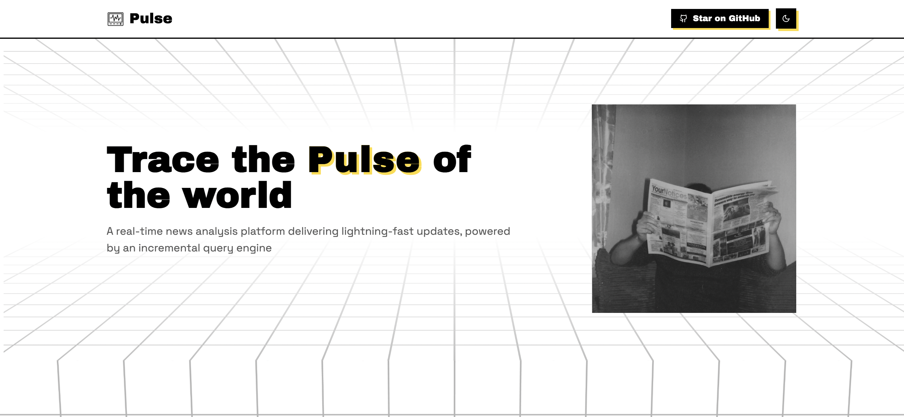

# Pulse UI
`pulse-ui` is the frontend for `Pulse`, serving as the user interface of the application. It communicates with the backend and updates in real time through streaming data

## License
[MIT](./LICENCE.md)
